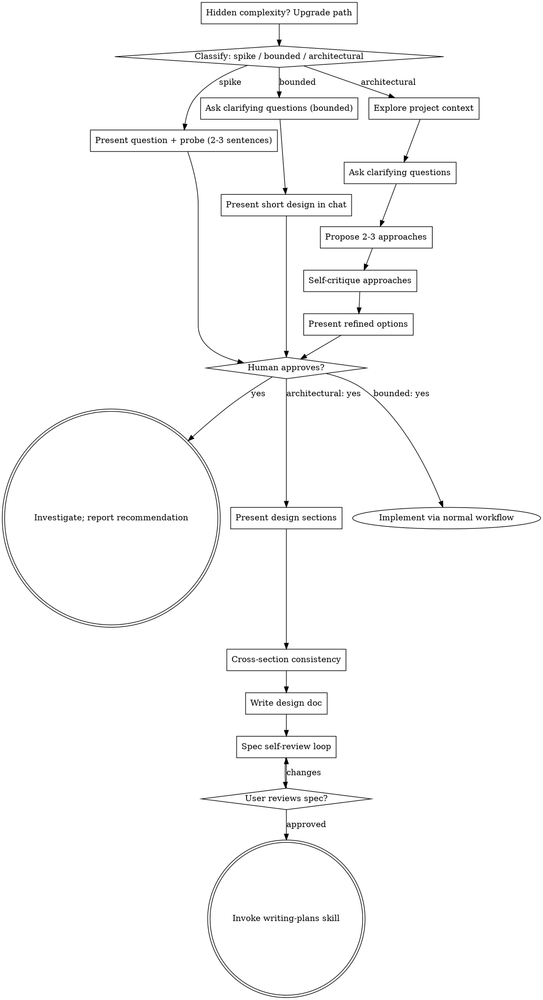

# Brainstorming Ideas Into Designs

Help turn ideas into fully formed designs and specs through natural collaborative dialogue — with iteration loops that refine until the design is solid, not just presented.

Start by classifying how much process the request needs, then work
through your path: understand the context, refine the idea, present a
design, and get your human partner's approval.

<HARD-GATE>
Do NOT invoke any implementation skill, write any code, scaffold any
project, or take any implementation action until you have told your
human partner what you intend and they have approved it. This applies
to EVERY task on EVERY path below — the ceremony scales with the task;
the approval gate never does.
</HARD-GATE>

## Three Paths

Before your first question, classify the request and say the
classification out loud — "this looks bounded, so I'll present a short
design here rather than write a spec" — so your human partner can
override it:

- **Spike** — a feasibility question ("can we...", "is it possible...",
  "quick and dirty is fine") whose output is an answer, not code you
  keep. Present the question and what you'll try in 2-3 sentences, get
  a nod, then find out as cheaply as correctness allows. No design
  doc, no spec file. Report findings as a recommendation; anything you
  built stays labeled throwaway.
- **Bounded** — a well-scoped change to code that already exists in
  this repo: a new flag, a small endpoint, a one-file fix.
  Understanding the kind of app is not enough — bounded means the flow
  you are changing is already here to read. If there is no existing
  flow to change, the task is not bounded. Ask the clarifying
  questions that matter, present a short design IN CHAT (a few
  sentences to a few short paragraphs), and STOP. Implementation
  starts only after your human partner says yes to that design — a
  bounded task's approval is as hard a gate as an architectural
  one. No spec file, no implementation plan document.
- **Architectural** — new projects, new subsystems, changes that
  restructure how components fit together or alter interfaces others
  depend on. Follow the full process: questions, approaches, sectioned
  design, written spec, then the writing-plans skill.

When in doubt between two paths, take the heavier one. The ratchet is
one-way: hidden complexity discovered mid-task upgrades the path —
stop, say so, and step up. Nothing downgrades mid-task.

## Anti-Pattern: "Too Simple To Need Approval"

Every path ends with your human partner approving your intent before
implementation. A todo list, a single-function utility, a config
change — the design may be two sentences in chat, but you MUST present
it and get approval. "Simple" tasks are where unexamined assumptions
cause the most wasted work. What scales with simplicity is the
artifact, never the approval.

## Red Flags

| Thought                                                                  | Reality                                                                                                    |
| ------------------------------------------------------------------------ | ---------------------------------------------------------------------------------------------------------- |
| "This is too simple to need a design"                                    | Simple means a short design, not no design. Two sentences in chat, then approval.                          |
| "I'll call it bounded and skip the spec"                                 | Reaching for a label to skip work IS the doubt — take the heavier path.                                    |
| "It's bounded and the design is obvious — I'll start while they read it" | The gate is the approval, not the design's length. Present, then stop until you hear yes.                  |
| "I understand this kind of app, so it's bounded"                         | Bounded measures the repo, not your familiarity. A new project has no existing flow — it is architectural. |
| "The spike works, so I'll keep the code"                                 | A spike's output is an answer. Keeping the code is a new request — classify it.                            |
| "It grew, but I'm almost done — no need to re-classify"                  | Hidden complexity upgrades the path mid-task. Stop and say so.                                             |
| "They approved the spike, so the follow-up change is approved too"       | Each task gets its own classification and its own approval.                                                |

## Loop Mode — How This Skill Iterates

The brainstorming process is not linear — it loops. Each phase has a quality gate, and you iterate until the gate passes. This is what separates a design that works from a design that's been thought through.

### The Master Loop

```
CLASSIFY: spike / bounded / architectural
    ↓
UNDERSTAND: question queue → ask → learn → refine → ask again
    ↓  (loop until you can articulate the problem better than the user)
EXPLORE: propose approaches → critique → revise → present refined options
    ↓  (loop until approaches are YAGNI'd down to what matters)
DESIGN: present section → get feedback → revise → re-present
    ↓  (loop until each section is approved)
VERIFY: cross-section consistency check
    ↓  (loop until all sections fit together without contradiction)
GATE: approval from human → proceed or revise
```

**The principle:** Don't present a design and hope it's right. Iterate until it IS right. Each loop reduces the chance of building the wrong thing.

---

## Phase 1: Understand (Question Loop)

Don't ask all questions at once. Ask one, learn, adapt, ask the next.

### Question Queue

Before asking anything, build a mental question queue:

1. **Scan the request** — what's explicit, what's implied, what's missing?
2. **List unknowns** — purpose, constraints, users, scope, success criteria, integration points, timeline
3. **Prioritize** — which unknowns block the design? Ask those first.
4. **Adapt** — as answers come in, some unknowns resolve, new ones appear. Update the queue.

### The Loop

```
For EACH question in queue (priority order):
  → Ask ONE question (multiple choice when possible)
  → Wait for answer
  → Learn: what did this answer tell you about the problem?
  → Refine: does this change your understanding? Update queue.
  → Next question (or: "I think I have enough — let me present a design")
```

### When to Stop Asking

- You can articulate the problem back to the user in their terms
- You can name the constraints that matter
- You can describe what success looks like
- You have enough to propose 2-3 concrete approaches
- **Stop before you're bored of asking** — the user is here to build, not interview

### Adaptive Questioning

Don't follow a script. Let answers guide the next question:

- User says "it's for the dashboard" → ask about which dashboard surface
- User says "it needs to be fast" → ask about what "fast" means (latency? throughput? render time?)
- User says "like QuickBooks but better" → ask what specifically about QuickBooks is broken
- User says "just make it work" → ask about the minimum that counts as working

### Scope Check

If the request describes multiple independent subsystems (e.g., "build a platform with chat, file storage, billing, and analytics"), flag this immediately. Don't spend questions refining details of a project that needs to be decomposed first. Help the user break it into sub-projects, then brainstorm the first one through the normal flow.

---

## Phase 2: Explore (Approach Refinement Loop)

Don't present your first idea. Refine it.

### First Pass: Generate Approaches

Propose 2-3 different approaches with trade-offs:

- Lead with your recommended option and explain why
- Name what each approach optimizes for (speed, flexibility, simplicity, etc.)
- YAGNI ruthlessly — remove unnecessary features from every approach

### Second Pass: Critique Your Own Approaches

Before presenting, stress-test each approach:

| Question                     | What to Check                           |
| ---------------------------- | --------------------------------------- |
| What breaks?                 | Edge cases, failure modes, scale limits |
| What's overbuilt?            | YAGNI check — can we remove this?       |
| What's missing?              | Error handling, security, monitoring    |
| What depends on what?        | Coupling between components             |
| What's the simplest version? | Can we ship less and iterate?           |

### The Loop

```
Generate 2-3 approaches
  → Self-critique each: what breaks? what's overbuilt? what's missing?
  → Revise: cut the overbuilt, fix the breaks, add the missing
  → If approaches converged (two are now the same): merge them
  → If approaches are still distinct: present refined options to user
  → If critique revealed the problem is bigger: upgrade to architectural path
```

### Presenting to User

Present the refined approaches conversationally:

- "I considered three options. Here's what I recommend and why..."
- "Option A optimizes for X but costs Y. Option B..."
- "My recommendation: [approach] because [reasoning]"
- Let the user push back — that's the point

---

## Phase 3: Design (Section Iteration Loop)

Don't dump a 2000-word design. Present section by section, iterate on each.

### Design Sections

Scale each section to its complexity:

| Section        | When to Include                                    | Typical Length |
| -------------- | -------------------------------------------------- | -------------- |
| Architecture   | Always (architectural path)                        | 200-400 words  |
| Components     | When UI or module structure matters                | 150-300 words  |
| Data Flow      | When data moves between systems                    | 100-200 words  |
| Error Handling | Always                                             | 50-100 words   |
| Testing        | Always                                             | 50-100 words   |
| Security       | When auth, data access, or financial data involved | 50-100 words   |

### The Loop

```
For EACH design section:
  → Present the section (scaled to complexity)
  → Get feedback: "Does this look right so far?"
  → If APPROVED → mark section ✅, move to next
  → If FEEDBACK → revise the section based on feedback
  → If REJECTED → understand why, rethink, re-present
  → Max 3 revision rounds per section — if still stuck, ask a deeper question
```

### Design Principles

**Design for isolation and clarity:**

- Break the system into smaller units that each have one clear purpose
- Communicate through well-defined interfaces
- Each unit: what does it do, how do you use it, what does it depend on?
- Can someone understand what a unit does without reading its internals?
- Can you change the internals without breaking consumers?
- Smaller, well-bounded units are easier to reason about and test

**Work in existing codebases:**

- Explore the current structure before proposing changes
- Follow existing patterns
- Where existing code has problems that affect the work, include targeted improvements
- Don't propose unrelated refactoring — stay focused on the goal

---

## Phase 4: Verify (Consistency Check)

After all sections are individually approved, check they fit together.

### Cross-Section Consistency

```
For EACH pair of design sections:
  → Do they contradict each other?
  → Do they use the same terminology?
  → Do their interfaces align?
  → Are there gaps between sections?
```

### Consistency Matrix

| Check          | What to Verify                                          |
| -------------- | ------------------------------------------------------- |
| Terminology    | Same names for same things across all sections          |
| Interfaces     | Section A's output matches Section B's input            |
| Scope          | No section promises more than the architecture supports |
| Error handling | Every failure path in data flow has a handler           |
| Security       | Every data access point has auth in the design          |
| Testing        | Every component has a test strategy                     |

### The Loop

```
Run consistency checks
  → Found contradiction? Fix it, re-check affected sections
  → Found gap? Add the missing piece, re-check
  → Found terminology drift? Standardize, update all sections
  → Re-run checks until 0 issues
```

---

## Paths

### Spike Path

1. **Explore project context** — enough to frame the probe
2. **Present question + probe plan** — 2-3 sentences
3. **Get approval** — a nod is enough
4. **Investigate** — as cheaply as correctness allows
5. **Report findings** — a recommendation; label anything built as throwaway

### Bounded Path

1. **Explore project context** — check files, docs, recent commits
2. **Ask clarifying questions** — one at a time, the ones that matter (Question Loop)
3. **Present short design in chat** — approach, files touched, testing (Approach Refinement Loop — condensed)
4. **Get approval** — STOP and wait for an explicit yes
5. **Implement** — proceed with normal development workflow (TDD applies)

### Architectural Path

1. **Explore project context** — check files, docs, recent commits
2. **Offer the visual companion just-in-time** — NOT upfront. Only when a question would genuinely be clearer shown than described. See Visual Companion section below.
3. **Ask clarifying questions** — one at a time, understand purpose/constraints/success criteria (Question Loop)
4. **Propose 2-3 approaches** — with trade-offs and your recommendation (Approach Refinement Loop)
5. **Present design** — section by section, get approval after each (Section Iteration Loop)
6. **Cross-section consistency check** — verify all sections fit together (Consistency Check)
7. **Write design doc** — save to `docs/superpowers/specs/YYYY-MM-DD-<topic>-design.md` and commit
8. **Spec self-review** — loop: scan for placeholders, contradictions, ambiguity, scope — fix inline — re-scan until clean
9. **User reviews written spec** — ask user to review before proceeding
10. **Transition to implementation** — invoke writing-plans skill

---

## Spec Self-Review Loop

After writing the spec, review it with fresh eyes. This is not a one-shot check — loop until it's clean.

```
ROUND 1: Scan for issues
  → Placeholder scan: any "TBD", "TODO", incomplete sections?
  → Internal consistency: do sections contradict each other?
  → Scope check: focused enough for one implementation plan?
  → Ambiguity check: could any requirement be interpreted two ways?

ROUND 2: Fix what you found
  → Fix all placeholders with concrete content
  → Resolve contradictions (pick one interpretation, make explicit)
  → Decompose if scope is too large
  → Disambiguate every vague requirement

ROUND 3: Re-scan
  → Did fixes introduce new issues?
  → Is the spec now internally consistent?
  → Can a reader follow the spec without asking questions?

If issues remain → fix and re-scan (max 3 rounds)
If clean → proceed to user review gate
```

---

## Visual Companion

A browser-based companion for showing mockups, diagrams, and visual options during brainstorming. Available as a tool — not a mode. Accepting the companion means it's available for questions that benefit from visual treatment; it does NOT mean every question goes through the browser.

**Offering the companion (just-in-time):** Do NOT offer it upfront. Wait until a question would genuinely be clearer shown than told — a real mockup / layout / diagram question, not merely a UI _topic_. The first time that happens, offer it then, as its own message:

> "This next part might be easier if I show you — I can put together mockups, diagrams, and comparisons in a browser tab as we go. It's still new and can be token-intensive. Want me to? I'll open it for you."

**This offer MUST be its own message.** Only the offer — no clarifying question, summary, or other content. Wait for the user's response. If they accept, start the server with `--open` so their browser opens to the first screen automatically. If they decline, continue text-only and don't offer again unless they raise it.

**Per-question decision:** Even after the user accepts, decide FOR EACH QUESTION whether to use the browser or the terminal. The test: **would the user understand this better by seeing it than reading it?**

- **Use the browser** for content that IS visual — mockups, wireframes, layout comparisons, architecture diagrams, side-by-side visual designs
- **Use the terminal** for content that is text — requirements questions, conceptual choices, tradeoff lists, A/B/C/D text options, scope decisions

A question about a UI topic is not automatically a visual question. "What does personality mean in this context?" is a conceptual question — use the terminal. "Which wizard layout works better?" is a visual question — use the browser.

If they agree to the companion, read the detailed guide before proceeding:
`skills/brainstorming/visual-companion.md`

---

## Progress Tracking

For multi-session brainstorming (architectural path), track where you are:

```
BRAINSTORMING STATUS:
Path: Architectural
Phase: Design (section 3/5)
Questions asked: 8/12 answered
Approaches refined: 3 → 2 (merged similar)
Design sections: ✅ Architecture, ✅ Components, 🔄 Data Flow, ⬜ Error Handling, ⬜ Testing
Consistency check: pending
Spec: not written yet
Approval: pending
```

This helps if the session is interrupted and resumed — you know exactly where you left off.

---

## Process Flow



**Terminal states are path-bound.** Architectural: the ONLY skill you
invoke after brainstorming is writing-plans. Bounded: after
approval, implementation proceeds directly through the normal
development workflow. Spike: the terminal state is a reported recommendation.
