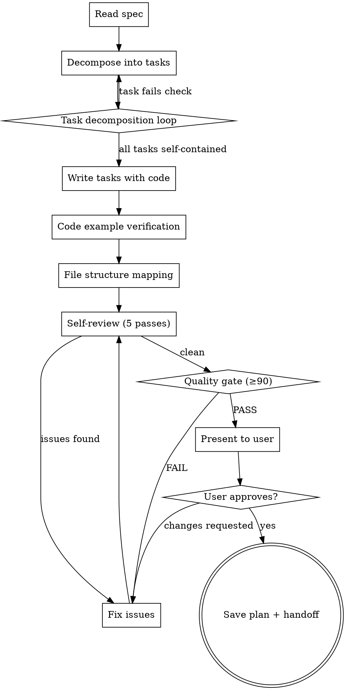

# Writing Plans

## Overview

Write comprehensive implementation plans assuming the engineer has zero context for our codebase and questionable taste. Document everything they need to know: which files to touch for each task, code, testing, docs they might need to check, how to test it. Give them the whole plan as bite-sized tasks. DRY. YAGNI. TDD. Frequent commits.

Assume they are a skilled developer, but know almost nothing about our toolset or problem domain. Assume they don't know good test design very well.

**Announce at start:** "I'm using the writing-plans skill to create the implementation plan."

**Context:** If working in an isolated worktree, it should have been created via the `superpowers:using-git-worktrees` skill at execution time.

**Save plans to:** `docs/superpowers/plans/YYYY-MM-DD-<feature-name>.md`

- (User preferences for plan location override this default)

## Loop Mode — How This Skill Iterates

Writing a plan is not a one-shot activity. You iterate through decomposition, review, and verification loops until the plan is solid. This is what separates a plan that works from a plan that looks right but breaks on execution.

### The Master Loop

```
READ SPEC → DECOMPOSE → VERIFY TASKS → WRITE TASKS → REVIEW → FIX → RE-REVIEW → QUALITY GATE → USER APPROVAL
    ↓              ↓              ↓              ↓          ↓      ↓           ↓              ↓              ↓
 understand    break down     check each     write full   scan   fix all    re-scan      score ≥90     user says
 the spec      into tasks     is self-       task with    for    issues     until clean   = READY       "go"
                            contained       code blocks  issues
```

**The principle:** Don't write a plan and hope it's right. Iterate until it IS right. Each loop reduces the chance of an engineer getting stuck, confused, or building the wrong thing.

---

## Phase 1: Read and Understand the Spec

Before decomposing anything, read the entire spec. Understand it deeply.

### Spec Analysis

```
For EACH section of the spec:
  → What does this require?
  → What are the constraints?
  → What are the success criteria?
  → What depends on what?
  → What's ambiguous?
  → Is this AI-native or SaaS? (must be AI-native)
  → Which surface does this belong to? (Command Center, Activity Hub, Financial Pulse, Ledger, Operations)
  → Does this require human-in-the-loop approval?
  → Does AI handle the work, or is this manual?
```

### Ambiguity Resolution

If the spec has ambiguous requirements, flag them — don't guess:

- "Add appropriate error handling" → which errors? what handling?
- "Should be performant" → what's the latency target?
- "Handle edge cases" → which edge cases?

Resolve ambiguities by asking the user or making a reasonable assumption and documenting it explicitly in the plan.

### Scope Check

If the spec covers multiple independent subsystems, it should have been broken into sub-project specs during brainstorming. If it wasn't, suggest breaking this into separate plans — one per subsystem. Each plan should produce working, testable software on its own.

---

## Phase 2: Decompose into Tasks (Task Decomposition Loop)

Don't write tasks immediately. Decompose iteratively.

### First Pass: Identify Deliverables

List what the spec requires as concrete deliverables:

- New files to create
- Existing files to modify
- Tests to write
- Documentation to update
- Configuration to change

### Second Pass: Group by Dependency

Group deliverables into tasks based on what depends on what:

- Tasks with no dependencies can be parallelized
- Tasks that depend on earlier tasks must be sequential
- Each task should produce a working, testable deliverable

### Third Pass: Right-Size

A task is the smallest unit that carries its own test cycle and is worth a
fresh reviewer's gate. Check each task:

| Check                    | Question                                                                              |
| ------------------------ | ------------------------------------------------------------------------------------- |
| Self-contained           | Can this task be implemented without knowing about other tasks (except earlier ones)? |
| Testable                 | Does this task have a clear, verifiable test?                                         |
| Right-sized              | Is this 2-30 minutes of work? Too big = split. Too small = merge.                     |
| Independently rejectable | Could a reviewer approve this task while rejecting its neighbor?                      |
| Complete                 | Does this task include setup, implementation, testing, and commit?                    |

### The Loop

```
List all deliverables (from spec)
  → Group by dependency → first draft of tasks
  → For EACH task: check self-contained? testable? right-sized?
  → If ANY task fails: split it, merge it, or redefine it
  → Re-check all tasks after changes (changes can cascade)
  → Until ALL tasks pass all checks
```

### Task Right-Sizing Rules

- **Too big:** If a task touches more than 3-4 files or takes >30 minutes, split it
- **Too small:** If a task is just "write one function" with no test, merge it into the next task
- **Missing test:** Every task MUST end with a testable deliverable. No exceptions.
- **Missing commit:** Every task MUST end with a commit. The engineer should be able to stop after any task and have working software.

---

## Phase 3: Write Tasks (Code Example Loop)

Now write each task with full detail. Every code block must be real, not placeholder.

### Task Structure

````markdown
### Task N: [Component Name]

**Files:**

- Create: `exact/path/to/file.py`
- Modify: `exact/path/to/existing.py:123-145`
- Test: `tests/exact/path/to/test.py`

**Interfaces:**

- Consumes: [what this task uses from earlier tasks — exact signatures]
- Produces: [what later tasks rely on — exact function names, parameter
  and return types]

- [ ] **Step 1: Write the failing test**

```python
def test_specific_behavior():
    result = function(input)
    assert result == expected
```

- [ ] **Step 2: Run test to verify it fails**

Run: `pytest tests/path/test.py::test_name -v`
Expected: FAIL with "function not defined"

- [ ] **Step 3: Write minimal implementation**

```python
def function(input):
    return expected
```

- [ ] **Step 4: Run test to verify it passes**

Run: `pytest tests/path/test.py::test_name -v`
Expected: PASS

- [ ] **Step 5: Commit**

```bash
git add tests/path/test.py src/path/file.py
git commit -m "feat: add specific feature"
```
````

### Code Example Verification

For EVERY code block in the plan:

| Check        | What to Verify                                           |
| ------------ | -------------------------------------------------------- |
| Syntax       | Does the code parse without errors?                      |
| Types        | Do function signatures match what's described?           |
| Imports      | Are all imports listed or obvious from context?          |
| Testability  | Does the test actually test the implementation?          |
| Independence | Can this code be understood without reading other tasks? |

### The Loop

```
For EACH task in the plan:
  → Write the full task with code blocks
  → Verify every code block: syntax correct? types match? imports present?
  → Verify the test tests the implementation (not something else)
  → Verify interfaces: consumes from earlier tasks, produces for later tasks
  → If ANY check fails: fix the code block, re-verify
  → Mark task ✅
```

---

## Phase 4: File Structure

Before finalizing tasks, map out which files will be created or modified and what each one is responsible for. This is where decomposition decisions get locked in.

### File Structure Rules

- Design units with clear boundaries and well-defined interfaces
- Each file should have one clear responsibility
- You reason best about code you can hold in context at once
- Prefer smaller, focused files over large ones that do too much
- Files that change together should live together
- Split by responsibility, not by technical layer
- In existing codebases, follow established patterns

### File-to-Task Mapping

After writing all tasks, verify:

```
For EACH file in the file structure:
  → Is it created/modified in exactly one task? (no duplicates)
  → Does the task that creates it include all necessary changes?
  → Are there files mentioned in tasks but not in the file structure? (add them)
  → Are there files in the structure but not in any task? (add them to a task)
```

---

## Phase 5: Self-Review (Multi-Pass Loop)

After writing the complete plan, review it rigorously. This is not a one-shot check — loop until it's clean.

### Pass 1: Spec Coverage

```
For EACH section/requirement in the spec:
  → Can you point to a specific task that implements it?
  → If NO → add the task
  → If YES → does the task actually cover the full requirement?
```

### Pass 2: Placeholder Scan

Search the plan for red flags — any of these patterns:

- "TBD", "TODO", "implement later", "fill in details"
- "Add appropriate error handling" / "add validation" / "handle edge cases"
- "Write tests for the above" (without actual test code)
- "Similar to Task N" (repeat the code — engineer may read tasks out of order)
- Steps that describe what to do without showing how
- References to types, functions, or methods not defined in any task

### Pass 3: Type Consistency

```
For EACH function/method/variable used across tasks:
  → Is it defined in an earlier task?
  → Are the types consistent across all uses?
  → Are the names consistent? (no clearLayers() in Task 3, clearFullLayers() in Task 7)
```

### Pass 4: Dependency Chain

```
For EACH task:
  → Does its "Consumes" section list everything it needs from earlier tasks?
  → Does its "Produces" section list everything later tasks need?
  → Are there implicit dependencies not documented? (add them)
  → Is the task order correct? (no task depends on a later task)
```

### Pass 5: Execution Feasibility

```
For EACH task:
  → Can an engineer with zero context implement this?
  → Are the run commands correct? (exact paths, exact flags)
  → Are the expected outcomes specific? (not "works" but "PASS" or specific error)
  → Is the commit message accurate?
```

### The Loop

```
PASS 1: Spec coverage → found 2 gaps → added 2 tasks
PASS 2: Placeholder scan → found 3 red flags → fixed them
PASS 3: Type consistency → found 1 naming mismatch → fixed it
PASS 4: Dependency chain → found 1 implicit dependency → documented it
PASS 5: Execution feasibility → found 1 vague step → made it specific

RE-SCAN: Did fixes introduce new issues?
  → Re-run all 5 passes
  → If clean → proceed to quality gate
  → If issues found → fix and re-scan (max 3 rounds)
```

---

## Phase 6: Quality Gate

Before presenting the plan to the user, score it.

### Quality Score

| Dimension     | Weight | Check                                                     |
| ------------- | ------ | --------------------------------------------------------- |
| Spec Coverage | 25%    | Every requirement has a task                              |
| Task Quality  | 25%    | Every task is self-contained, testable, right-sized       |
| Code Examples | 20%    | Every code block is real, syntactically correct, runnable |
| Dependencies  | 15%    | Every dependency documented, order correct                |
| Completeness  | 15%    | No placeholders, no ambiguity, no gaps                    |

**Scoring:**

- Each dimension: 0-100
- Weighted average ≥ 90 → PASS
- Weighted average < 90 → identify weakest dimension, improve, re-score

### The Loop

```
Score the plan
  → Weakest dimension: Code Examples (72/100)
  → Fix: verify all code blocks compile, add missing imports
  → Re-score: Code Examples now 95/100
  → Total: 93/100 → PASS
```

---

## Plan Document Header

**Every plan MUST start with this header:**

```markdown
# [Feature Name] Implementation Plan

> **For agentic workers:** REQUIRED SUB-SKILL: Use superpowers:subagent-driven-development (recommended) or superpowers:executing-plans to implement this plan task-by-task. Steps use checkbox (`- [ ]`) syntax for tracking.

**Goal:** [One sentence describing what this builds]

**Architecture:** [2-3 sentences about approach]

**Tech Stack:** [Key technologies/libraries]

**Spec:** [path to the spec/design doc this plan implements — the plan
argues from the spec, so the spec travels with it; executors read both]

## Global Constraints

[The spec's project-wide requirements — version floors, dependency limits,
naming and copy rules, platform requirements — one line each, with exact
values copied verbatim from the spec. Every task's requirements implicitly
include this section.]

---
```

---

## Execution Handoff

After saving the plan and passing quality gate, offer execution choice:

**"Plan complete and saved to `docs/superpowers/plans/<filename>.md`. Two execution options:**

**1. Subagent-Driven (recommended)** — I dispatch a fresh subagent per task, review between tasks, fast iteration

**2. Inline Execution** — Execute tasks in this session using executing-plans, batch execution with checkpoints

**Which approach?"**

**If Subagent-Driven chosen:**

- **REQUIRED SUB-SKILL:** Use superpowers:subagent-driven-development
- Fresh subagent per task + two-stage review

**If Inline Execution chosen:**

- **REQUIRED SUB-SKILL:** Use superpowers:executing-plans
- Batch execution with checkpoints for review

---

## Progress Tracking

For large plans, track where you are in the writing process:

```
PLAN STATUS:
Spec read: ✅
Decomposition: ✅ (12 tasks identified)
Task writing: ✅ (12/12 tasks written)
Self-review: 🔄 Pass 3/5 (type consistency — found 1 issue)
Quality gate: pending
User approval: pending
```

---

## Process Flow


