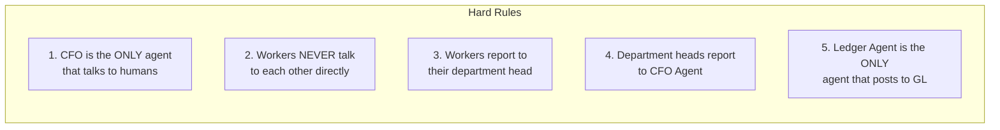
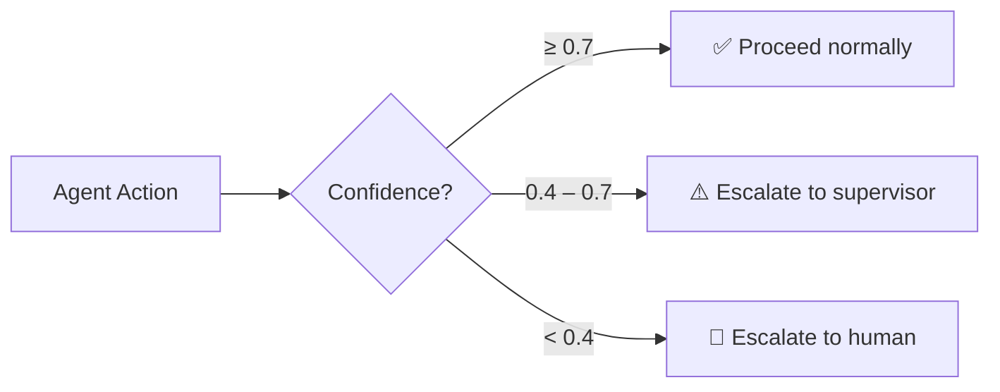
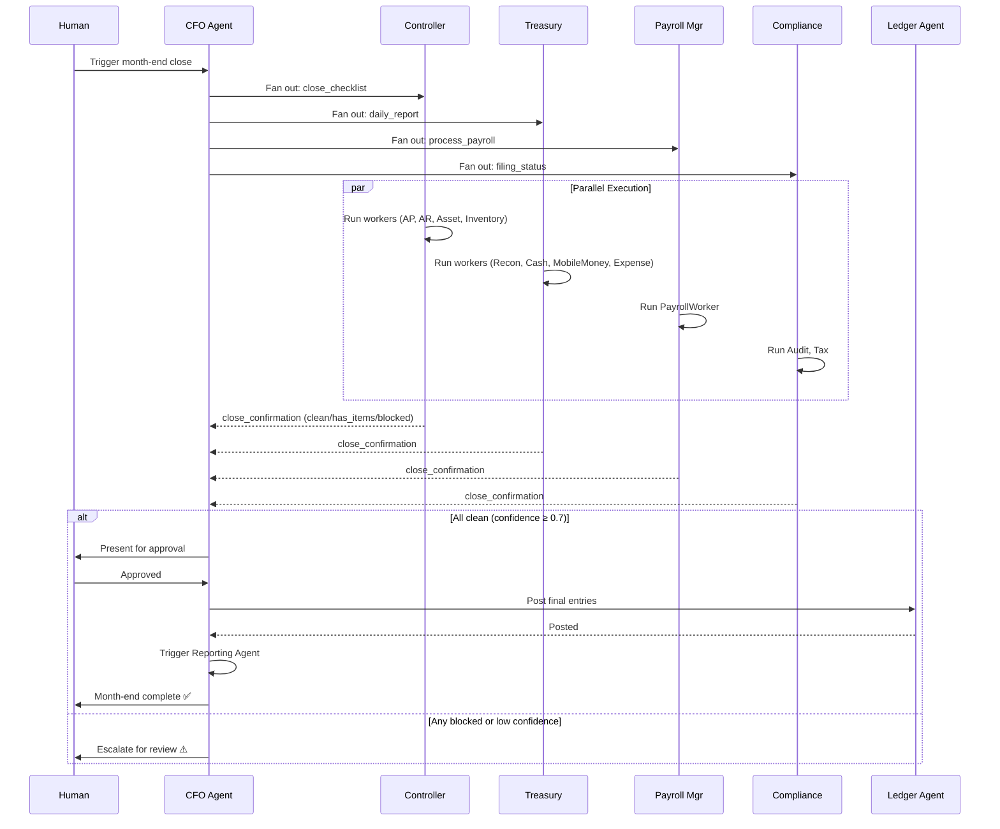
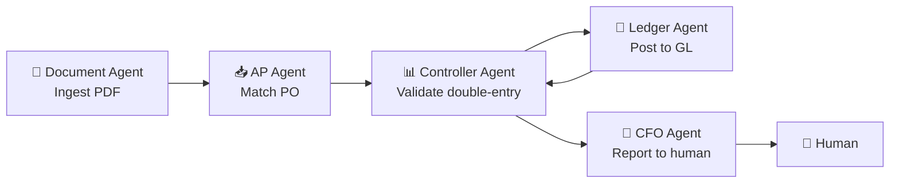
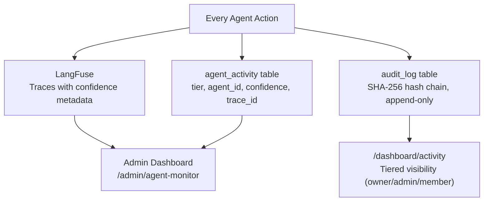
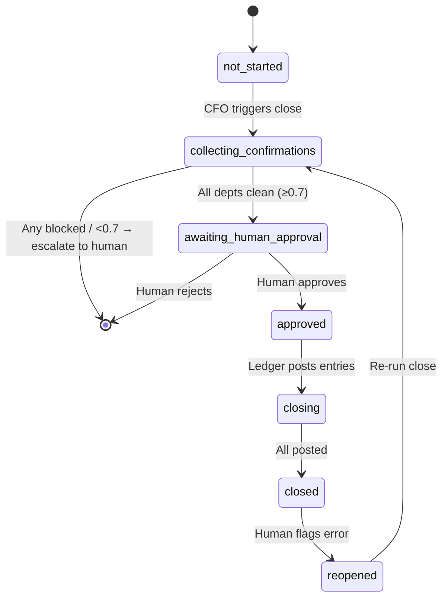

# Xenboox Agentic Flow

## 3-Tier Hierarchy

```mermaid
flowchart TD
    Human["👤 Human User"]

    subgraph Tier1["Tier 1 — Strategic"]
        CFO["🧠 CFO Agent<br/>Sonnet 4.6<br/>chat, question, close_trigger"]
    end

    subgraph Tier2["Tier 2 — Management (Department Heads)"]
        Controller["📊 Controller Agent<br/>Sonnet 4.6<br/>GL Integrity"]
        Treasury["💰 Treasury Agent<br/>Sonnet 4.6<br/>Cash & Banking"]
        PayrollMgr["👔 Payroll Manager<br/>Sonnet 4.6<br/>Payroll"]
        Compliance["⚖️ Compliance Agent<br/>Sonnet 4.6<br/>Tax & Audit"]
    end

    subgraph Tier3a["Tier 3 — Controller Dept Workers"]
        Ledger["📒 Ledger Agent*<br/>Sonnet 4.6<br/>GL Posting (Single Point of Entry)"]
        AP["📥 AP Agent<br/>Sonnet 4.6<br/>process_ap_invoice"]
        AR["📤 AR Agent<br/>Haiku+Sonnet<br/>ar_aging, match_payment"]
        Asset["🏦 Asset Agent<br/>depreciation, asset_register"]
        Inventory["📦 Inventory Agent<br/>cogs, inventory_summary"]
    end

    subgraph Tier3b["Tier 3 — Treasury Dept Workers"]
        Recon["🔄 Reconciliation Agent<br/>Sonnet 4.6<br/>bank_reconciliation"]
        Cash["💵 Cash Agent<br/>Haiku+Sonnet<br/>cash_count, imprest"]
        MobileMoney["📱 Mobile Money Agent<br/>Sonnet 4.6<br/>mm_reconcile, mm_ingest"]
        Expense["🧾 Expense Agent<br/>submit_expense, approve_expense"]
    end

    subgraph Tier3c["Tier 3 — Payroll Dept Workers"]
        PayrollWorker["⚙️ Payroll Worker<br/>calculate_paye, generate_payslip"]
    end

    subgraph Tier3d["Tier 3 — Compliance Dept Workers"]
        Audit["🔍 Audit Agent<br/>audit_sampling, anomaly_detection"]
        Tax["🏛️ Tax Agent<br/>tax_review, filing_status"]
    end

    subgraph Platform["Platform (Cross-Cutting)"]
        Reporting["📈 Reporting Agent<br/>report, narrative"]
        Document["📄 Document Agent<br/>Sonnet 4.6 + Haiku<br/>ingest, classify, extract"]
        Budget["📉 Budget Agent<br/>variance_analysis, forecast"]
        Analytics["📊 Analytics Agent<br/>ratios, kpi_dashboard, trends"]
    end

    %% Communication flows
    Human -->|instructions| CFO
    CFO -->|orchestrate| Controller
    CFO -->|orchestrate| Treasury
    CFO -->|orchestrate| PayrollMgr
    CFO -->|orchestrate| Compliance

    Controller -->|validate & dispatch| Ledger
    Controller -->|dispatch| AP
    Controller -->|dispatch| AR
    Controller -->|dispatch| Asset
    Controller -->|dispatch| Inventory

    Treasury -->|dispatch| Recon
    Treasury -->|dispatch| Cash
    Treasury -->|dispatch| MobileMoney
    Treasury -->|dispatch| Expense

    PayrollMgr -->|dispatch| PayrollWorker

    Compliance -->|dispatch| Audit
    Compliance -->|dispatch| Tax

    CFO -.->|use| Reporting
    CFO -.->|use| Document
    CFO -.->|use| Budget
    CFO -.->|use| Analytics

    Ledger -->|post to GL| Controller
    AP -->|journal entries| Controller
    AR -->|payment match| Controller
    Recon -->|reconciliation report| Treasury
    Cash -->|cash report| Treasury
    Expense -->|expense report| Treasury
    Audit -->|audit findings| Compliance
    PayrollWorker -->|payroll complete| PayrollMgr

    style CFO fill:#4F46E5,color:#fff
    style Controller fill:#7C3AED,color:#fff
    style Treasury fill:#059669,color:#fff
    style PayrollMgr fill:#D97706,color:#fff
    style Compliance fill:#DC2626,color:#fff
    style Ledger fill:#1E40AF,color:#fff,stroke:#fff,stroke-width:3px
    style Platform fill:#6B7280,color:#fff
```

---

## Communication Rules

---

## Confidence-Based Escalation

---

## Month-End Close Flow

---

## Invoice Processing Flow (Example)

---

## Observability Stack

---

## State Machine: Month-End Close

---

## Department → Agent Mapping

| Department          | Tier 2 Head           | Tier 3 Workers                                                      |
| ------------------- | --------------------- | ------------------------------------------------------------------- |
| **controller**      | Controller Agent      | Ledger Agent\*, AP Agent, AR Agent, Asset Agent, Inventory Agent    |
| **treasury**        | Treasury Agent        | Reconciliation Agent, Cash Agent, Mobile Money Agent, Expense Agent |
| **payroll_manager** | Payroll Manager Agent | Payroll Worker Agent                                                |
| **compliance**      | Compliance Agent      | Audit Agent, Tax Agent                                              |

_\* The Ledger Agent is a special Tier 3 worker that reports to the Controller Agent but is NOT part of any department — it is the single point of entry to the GL._

---

## Model Assignment

| Tier                | Model              | Purpose                                |
| ------------------- | ------------------ | -------------------------------------- |
| Tier 1 (CFO)        | Sonnet 4.6         | Strategic decisions, human interaction |
| Tier 2 (Dept Heads) | Sonnet 4.6         | Management, quality gates              |
| Tier 3 (Workers)    | Haiku / Sonnet mix | Execution, sub-ledger operations       |
| Platform            | Sonnet 4.6         | Shared services                        |

---

_View this file in a Mermaid-compatible renderer (GitHub, VS Code with Mermaid plugin, or https://mermaid.live) to see the diagrams._
